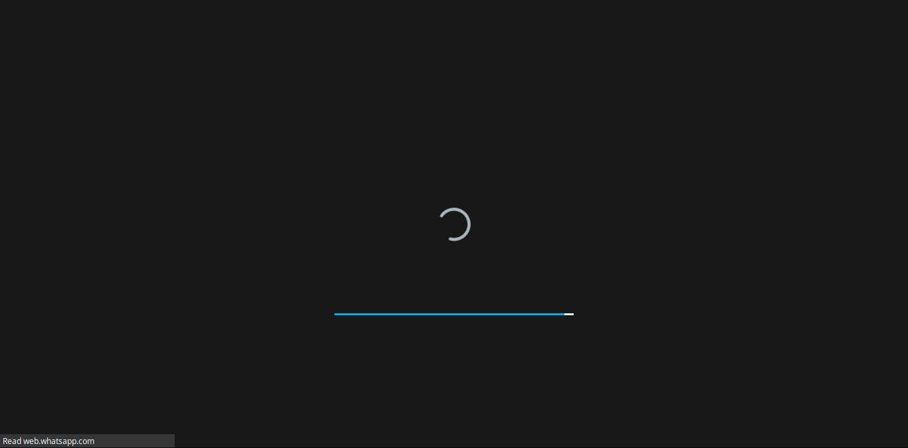
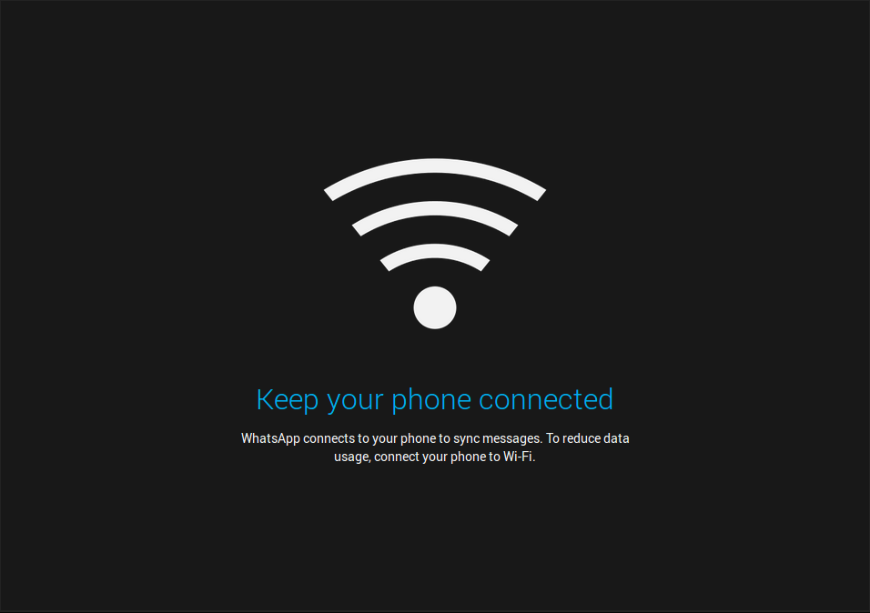

# WhatsApp-DeepDark

Talk with thy friends in the dark. May the dark be kinder on thine eyes. (WhatsApp dark theme)

This is a dark theme for WhatsApp inspired by [FT DeepDark](https://addons.mozilla.org/en-US/firefox/addon/ft-deepdark/?src=search). 

Also, credit where credit is due. ([@KDE](https://github.com/KDE), [@horst3180](https://github.com/horst3180), [@linuxmint](https://github.com/linuxmint), [Firefox](https://www.mozilla.org/en-US/firefox/new/), [YouTube](https://www.youtube.com/) and [Discord](https://discordapp.com/))

Theme as a userstyle [here](https://userstyles.org/styles/149830/whatsapp-deepdark).

### **You can also install all my themes at once from [here](https://gitlab.com/RaitaroH/Import-All-Deepdark).**

# Screemshots

# Colors 
The colors are available in the code; different colors can be used.

**Due to privacy reasons I will not upload any more images. Please look at my other themes to get an idea of the color palettes if you don't know how they look.**
